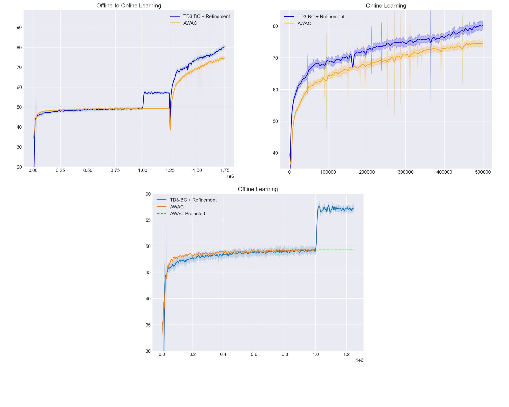

TODO: write readme, add wandb, show how to run code

# TLab: From Offline to Online



# Отчет
[Тут по ссылке](misc/TLab_test_Zisman.pdf)

## Запуск
Запустить проще всего через билд докер образа:

```
docker build -t  .
docker run -it --name <container-name> 
```

## W&B
Не очень красивые графики можно посмотреть тут. Они поделены на части, в целом это связано с тем, что не удалось провести непрерывный эксперимент, пришлось подгружать веса в процессе.

[Link](https://wandb.ai/suessmann/tlab-test/reports/TLab-offline-to-online--Vmlldzo0MDI0ODEy)